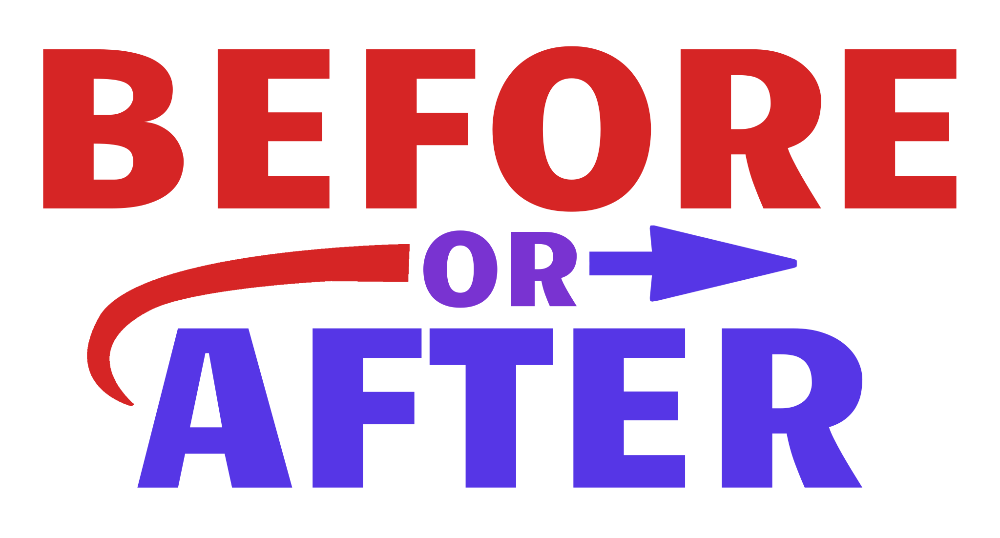

# Before or After

  
    
  
    

A daily, addictively engaging casual game where players guess the release year
of albums, artworks, images, movies, and more in short, self-paced rounds.

## Table of Contents

- [Overview](#overview)
  - [Purpose](#purpose)
  - [Team](#team)
- [Getting Started and Contributing](#getting-started-and-contributing)

## Overview

### Purpose

Before or After is a casual web-based game designed for anyone with a few spare
moments seeking quick, self-paced entertainment. Each day, players challenge
themselves to guess the release year of various cultural artifacts—albums,
artworks, images, movies, and more—using a simple before-or-after mechanic. This
trivia format keeps the experience fresh and educational, blending addictive
gameplay with knowledge gain.

## Team

The Merge Masters consists of 5 Cal Poly students. Over the course of about 5
weeks, we worked as a team to deploy this web application.

- [Kevin Rutledge](https://www.linkedin.com/in/rutledge-kevin/) - Software
  Developer

- [Sean Griffin](https://www.linkedin.com/in/sean-griffin-9855b126b/) - Software
  Developer

- [Yenny Ma](https://www.linkedin.com/in/yenny-ma/) - Software Developer

- [Venkata Ande](https://www.linkedin.com/in/venkata-g-ande-1b2057334/) -
  Software Developer

- [Thomas Hagos](https://www.linkedin.com/in/thomashagos/) - Software Developer

## Documentation

- [Getting Started](docs/getting-started.md) - Set up your development
  environment and install dependencies
- [Developer Guide](docs/developer-guide.md) - Explore technical architecture,
  API endpoints, and implementation patterns
- [Data Model](docs/data-model.puml) - Review database schema and entity
  relationships
- [Contributing Guidelines](docs/CONTRIBUTING.md) - Learn how to contribute code
  and submit pull requests
- [Authentication Flows](docs/README.md) - View authentication flows for signup
  and sign-in
