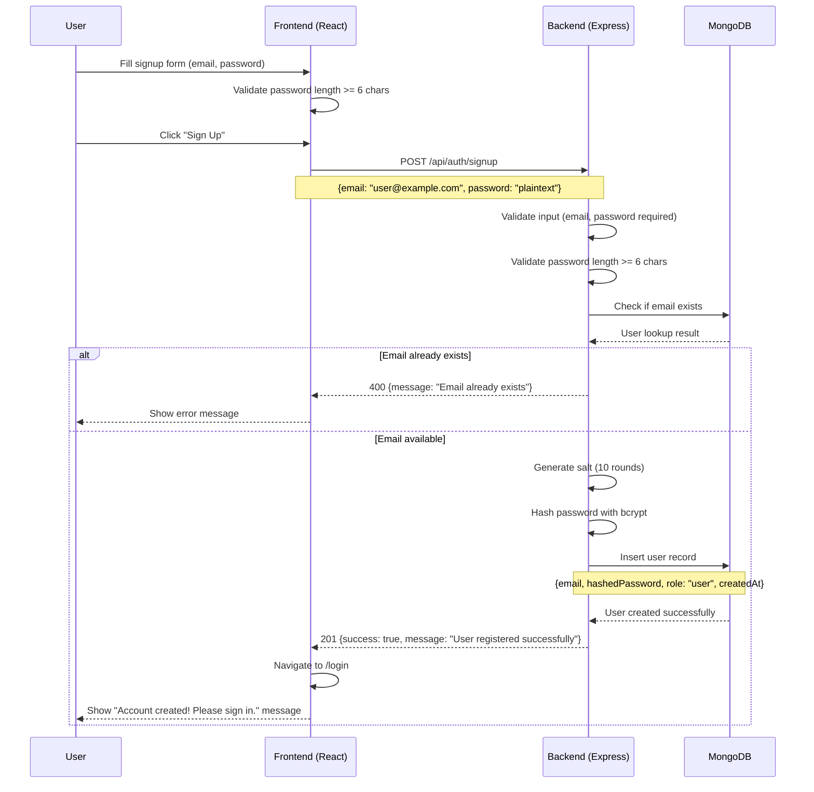
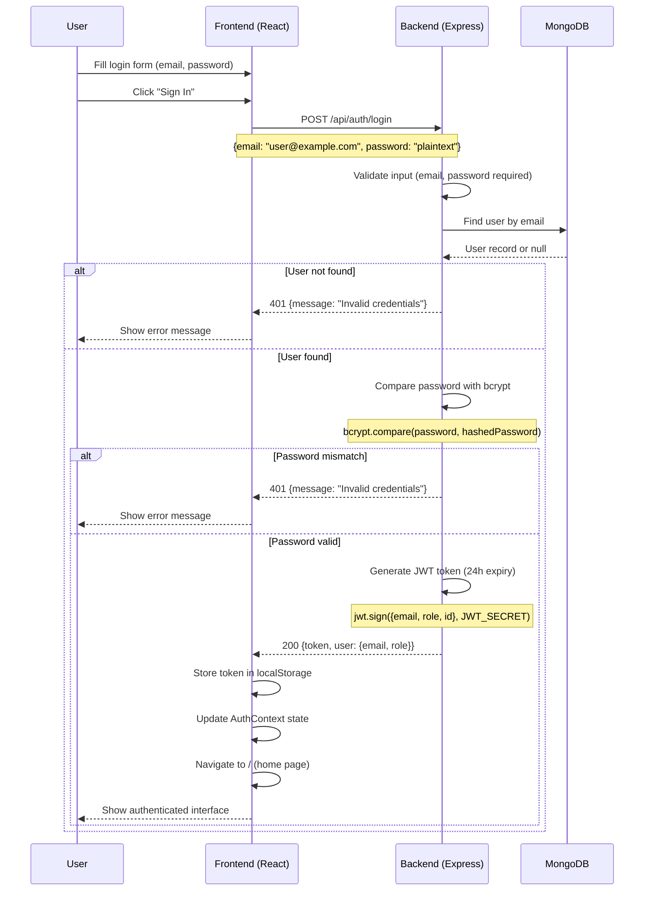

## Architecture Flows

### Sign-up

```mermaid
sequenceDiagram
    participant U as User
    participant F as Frontend (React)
    participant B as Backend (Express)
    participant DB as MongoDB

    U->>F: Fill signup form (email, password)
    F->>F: Validate password length >= 6 chars
    U->>F: Click "Sign Up"

    F->>B: POST /api/auth/signup
    Note over F,B: {email: "user@example.com", password: "plaintext"}

    B->>B: Validate input (email, password required)
    B->>B: Validate password length >= 6 chars

    B->>DB: Check if email exists
    DB-->>B: User lookup result

    alt Email already exists
        B-->>F: 400 {message: "Email already exists"}
        F-->>U: Show error message
    else Email available
        B->>B: Generate salt (10 rounds)
        B->>B: Hash password with bcrypt

        B->>DB: Insert user record
        Note over B,DB: {email, hashedPassword, role: "user", createdAt}
        DB-->>B: User created successfully

        B-->>F: 201 {success: true, message: "User registered successfully"}

        F->>F: Navigate to /login
        F-->>U: Show "Account created! Please sign in." message
    end
```

### Sign-in

```mermaid
sequenceDiagram
    participant U as User
    participant F as Frontend (React)
    participant B as Backend (Express)
    participant DB as MongoDB

    U->>F: Fill login form (email, password)
    U->>F: Click "Sign In"

    F->>B: POST /api/auth/login
    Note over F,B: {email: "user@example.com", password: "plaintext"}

    B->>B: Validate input (email, password required)

    B->>DB: Find user by email
    DB-->>B: User record or null

    alt User not found
        B-->>F: 401 {message: "Invalid credentials"}
        F-->>U: Show error message
    else User found
        B->>B: Compare password with bcrypt
        Note over B: bcrypt.compare(password, hashedPassword)

        alt Password mismatch
            B-->>F: 401 {message: "Invalid credentials"}
            F-->>U: Show error message
        else Password valid
            B->>B: Generate JWT token (24h expiry)
            Note over B: jwt.sign({email, role, id}, JWT_SECRET)

            B-->>F: 200 {token, user: {email, role}}

            F->>F: Store token in localStorage
            F->>F: Update AuthContext state
            F->>F: Navigate to / (home page)
            F-->>U: Show authenticated interface
        end
    end
```
